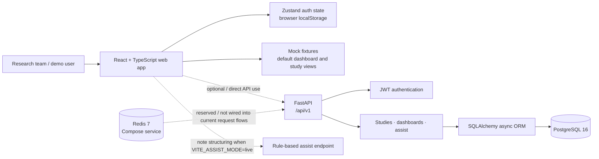
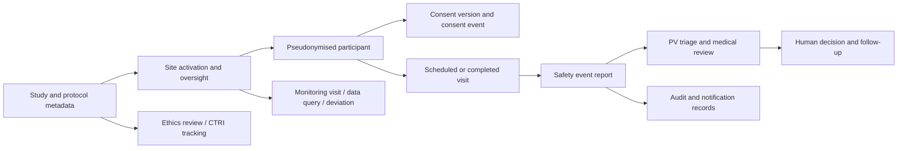
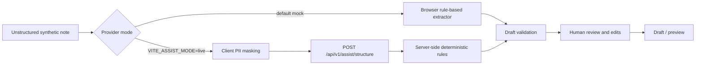

# PRAMAN — Clinical Research Command Centre

### Trust • Compliance • Safer Trials

> **Prototype notice:** PRAMAN is a Smart India Hackathon (SIH) demonstration built with synthetic data. It is not a validated clinical system, not submission-ready, and must not be used to collect or process real participant or patient data.

GCP-ASU-aligned controls · ICMR-guideline-supporting workflow · FHIR R4 / CDISC demonstration concepts · Synthetic data only

---

## Contents

- [What PRAMAN is](#what-praman-is)
- [At a glance](#at-a-glance)
- [How the system fits together](#how-the-system-fits-together)
- [Implemented scope and important limitations](#implemented-scope-and-important-limitations)
- [Technology stack](#technology-stack)
- [Quick start with Docker Compose](#quick-start-with-docker-compose)
- [Run services locally](#run-services-locally)
- [Configuration reference](#configuration-reference)
- [Demo accounts and walkthrough](#demo-accounts-and-walkthrough)
- [Application routes and permissions](#application-routes-and-permissions)
- [Backend API reference](#backend-api-reference)
- [Data model](#data-model)
- [AI-assisted note structuring](#ai-assisted-note-structuring)
- [Security and privacy notes](#security-and-privacy-notes)
- [Testing and development checks](#testing-and-development-checks)
- [Troubleshooting](#troubleshooting)
- [Roadmap](#roadmap)
- [Compliance and intended use](#compliance-and-intended-use)

## What PRAMAN is

PRAMAN is a role-oriented clinical research operations prototype for Ayurveda studies. Its screens bring together study oversight concepts such as site performance, participant and consent tracking, safety-case review, ethics submissions, monitoring, audit inspection, and draft clinical-note structuring.

The repository contains a React web application, a FastAPI service, PostgreSQL data models and synthetic seed fixtures, plus a Docker Compose development stack. It is a prototype: several screens and data views are demonstration UI backed by frontend mock fixtures, and not every data model has a corresponding persisted API workflow.

## At a glance

| Area | Current implementation |
|---|---|
| Web application | React 18 + TypeScript, Vite development server |
| API | FastAPI under `/api/v1`; interactive OpenAPI docs at `/api/docs` |
| Database | PostgreSQL 16; SQLAlchemy 2 async sessions |
| Demo cache/service | Redis 7 container is included in Compose |
| Authentication | Demo login, bcrypt password hashes, signed access and refresh JWTs |
| Authorization | Role checks in protected frontend routes and selected API handlers |
| AI note structuring | Deterministic, rule-based demo extraction; no live model invocation |
| Seed data | Synthetic studies, sites, pseudonymised participants, safety and compliance records |
| Intended use | Local demonstration and development only |

## How the system fits together

### Component architecture



The frontend API client currently forces mock mode for authentication, dashboards, and studies (`MOCK_MODE` is hard-coded on). Therefore, starting the backend and seeding PostgreSQL does **not** switch those parts of the UI to live API data. The backend can still be explored directly through Swagger at `/api/docs`. The note-structuring screen has a separate provider switch described below.

### Example clinical operations lifecycle



This diagram describes the domain represented by the data models and prototype screens; it is not a claim that every transition is implemented as a production workflow.

## Implemented scope and important limitations

The current repository includes:

- User, study, site, pseudonymised-participant, consent-version, consent-event, and visit models.
- Adverse-event, safety-follow-up, and safety-signal models.
- Ethics-review, CTRI-registration, protocol-deviation, monitoring-visit, and data-query models.
- Audit-event, electronic-signature, notification, and AI-interaction models.
- Backend endpoints for health/root metadata, authentication, role dashboards, studies, and note structuring.
- Frontend route screens for dashboards, studies, sites, participants, visits, safety, ethics, monitoring, exports, audit, and AI note structuring.

Keep these constraints in mind when evaluating the demo:

1. **Mock UI data:** dashboard and study data displayed by the web app comes from frontend fixtures in the current client implementation. Many other screens are prototype views and should not be treated as end-to-end persisted CRUD workflows.
2. **Seed command resets tables:** `python -m app.database.seed` calls `drop_all()` before recreating tables. It destroys existing data in the configured database. Use it only with a disposable local demo database.
3. **No migration-on-startup:** application startup calls SQLAlchemy `create_all()` to ensure tables exist. Alembic is installed, but this startup path does not apply Alembic migrations.
4. **Redis/Celery are not an active job system:** Compose starts Redis and the dependency list includes Celery, but there is no worker service in the current Compose file.
5. **No production-grade identity lifecycle:** refresh-token revocation, account recovery, and production account provisioning are not implemented. The API logout endpoint responds successfully but does not revoke a token.
6. **No live AI provider:** the server-side assist endpoint uses deterministic rules. The provider classes/interfaces are extension points, not a wired external model integration.
7. **Exports are demonstration scope:** FHIR/CDISC/inspection-pack wording describes alignment or prototype concepts, not validated regulatory deliverables.

## Technology stack

| Layer | Technologies |
|---|---|
| Frontend | React 18, TypeScript, Vite, Tailwind CSS, React Router |
| UI / state / forms | Zustand, TanStack Query, React Hook Form, Zod, Radix UI |
| Visualisation / icons | Recharts, Lucide React |
| HTTP | Axios |
| Backend | Python 3.12, FastAPI, Pydantic v2, Uvicorn |
| Persistence | SQLAlchemy 2 async ORM, PostgreSQL, asyncpg, psycopg2 |
| Authentication | python-jose JWT, Passlib bcrypt |
| Supporting services | Redis 7; Celery dependency (no configured worker) |
| Testing | Pytest, pytest-asyncio, HTTPX; Vitest, Testing Library |
| Local packaging | Docker Compose, PostgreSQL 16, Redis 7 |

## Quick start with Docker Compose

### Prerequisites

- Docker Desktop with Docker Compose
- Available host ports: `5174` (frontend), `8002` (API), `5434` (PostgreSQL), and `6381` (Redis)

Run these commands from the repository root (`PRAMAN`). In PowerShell:

```powershell
Copy-Item .env.example .env
docker compose up --build
```

The stack starts PostgreSQL, Redis, FastAPI, and the Vite development server. In a second terminal, seed the disposable demo database:

```powershell
docker compose exec backend python -m app.database.seed
```

> **Warning:** the seed module drops and recreates every table in the configured database. Do not run it against a database containing data you need.

Open:

| Service | URL |
|---|---|
| Frontend | <http://localhost:5174> |
| Backend health response | <http://localhost:8002/health> |
| Backend root metadata | <http://localhost:8002/> |
| Swagger / OpenAPI UI | <http://localhost:8002/api/docs> |
| ReDoc | <http://localhost:8002/api/redoc> |
| OpenAPI JSON | <http://localhost:8002/api/openapi.json> |

The Compose host ports are deliberately different from the local-development ports: Compose maps frontend `5173` to host `5174`, backend `8000` to host `8002`, PostgreSQL `5432` to host `5434`, and Redis `6379` to host `6381`. Service-to-service traffic uses Compose's internal ports and service names.

To stop the stack, run `docker compose down`. This preserves named volumes. To delete the database volume and all data stored in it, `docker compose down --volumes` is destructive; use it only when that reset is intended.

## Run services locally

### Backend

Install Python 3.12, PostgreSQL 16, and (if needed for parity with the Compose stack) Redis 7. Create a disposable database named `praman`, then from the repository root:

```powershell
Copy-Item .env.example backend\.env
Set-Location backend
py -3.12 -m venv .venv
.\.venv\Scripts\Activate.ps1
python -m pip install -r requirements.txt
uvicorn app.main:app --reload --port 8000
```

In another terminal, from the `backend` directory, seed the local demo database:

```powershell
python -m app.database.seed
```

Configure `DATABASE_URL` in `backend/.env` for your local PostgreSQL credentials. The async URL should use the `postgresql+asyncpg` driver; `DATABASE_URL_SYNC` is the synchronous PostgreSQL URL. The backend reads `.env` relative to its working directory, so start it from `backend` when using `backend/.env`.

Backend URLs: <http://localhost:8000/health>, <http://localhost:8000/api/docs>.

### Frontend

Install Node.js 20, then from the repository root:

```powershell
Set-Location frontend
npm install
npm run dev
```

Open <http://localhost:5173>. Vite proxies `/api` to `http://localhost:8000` by default. Set `VITE_API_BASE_URL` in the shell or in `frontend/.env.local` if your API is running elsewhere. Set `VITE_ASSIST_MODE=live` there to have the note-structuring screen call the backend assist endpoint. The existing API client still forces mock mode for login, dashboards, and studies; changing the API URL alone does not make those screens use the live backend.

## Configuration reference

`.env.example` is a development template, not a secure production configuration.

| Variable | Purpose | Template / Compose behavior |
|---|---|---|
| `POSTGRES_DB` | PostgreSQL database name | `praman` |
| `POSTGRES_USER` | PostgreSQL user | `praman_user` |
| `POSTGRES_PASSWORD` | PostgreSQL password | Demo default; replace outside a disposable local environment |
| `DATABASE_URL` | Async SQLAlchemy connection | Local default points to PostgreSQL on `localhost:5432`; Compose sets a service-network URL |
| `DATABASE_URL_SYNC` | Synchronous PostgreSQL connection | Used as an additional configured connection value; Compose sets an internal URL |
| `REDIS_URL` | Redis connection | Local default `localhost:6379`; Compose uses `redis:6379` internally |
| `SECRET_KEY` | JWT signing secret | Development placeholder; generate a unique, high-entropy value for any non-demo deployment |
| `ALGORITHM` | JWT signing algorithm | `HS256` |
| `ACCESS_TOKEN_EXPIRE_MINUTES` | Access-token lifetime | `60` |
| `REFRESH_TOKEN_EXPIRE_DAYS` | Refresh-token lifetime | `7` |
| `ENVIRONMENT` | Runtime mode / SQL echo toggle | `development` |
| `FRONTEND_ORIGIN` | Allowed frontend CORS origin | Local template `http://localhost:5173`; Compose defaults to `http://localhost:5174` |
| `VITE_API_BASE_URL` | Frontend API base URL | Local template `http://localhost:8000`; Compose defaults to `http://localhost:8002` |
| `VITE_ASSIST_MODE` | Note-structuring provider selection | Optional frontend setting; use `live` in `frontend/.env.local` to call the backend assist route; otherwise the browser uses its local mock extractor |

Vite variables are embedded into the browser bundle at build time. Never place private keys, credentials, or server-only secrets in `VITE_*` variables.

## Demo accounts and walkthrough

All seeded accounts use the shared demo password **`Demo@123`**. These credentials are public demo fixtures and must never be reused.

| Role | Login email | Default dashboard |
|---|---|---|
| Leadership | `leadership@praman.demo` | `/dashboard/leadership` |
| Principal Investigator (PI) | `pi@praman.demo` | `/dashboard/pi` |
| Study Coordinator | `coordinator@praman.demo` | `/dashboard/coordinator` |
| Pharmacovigilance (PV) Officer | `pv@praman.demo` | `/dashboard/pharmacovigilance` |
| Ethics Committee | `ethics@praman.demo` | `/dashboard/ethics` |
| Monitor | `monitor@praman.demo` | `/dashboard/monitor` |
| Regulator | `regulator@praman.demo` | `/dashboard/leadership` |
| Administrator | `admin@praman.demo` | `/dashboard/leadership` |

Suggested demo path:

1. Sign in as Leadership and review the portfolio dashboard, risk indicators, due dates, and critical-action queue.
2. Sign in as the PI to inspect assigned-study and safety-review concepts.
3. Sign in as Coordinator to view participant and consent/re-consent concepts.
4. Sign in as the PV Officer to inspect adverse-event and signal concepts.
5. Sign in as Ethics Committee to view the ethics review queue.
6. Sign in as Monitor to inspect site-monitoring concepts.
7. Open `/studies` to browse study cards and detail views.
8. Open `/ai-structuring` with an allowed role to try the synthetic note-structuring demonstration.

Dashboard and study UI data is served from mock fixtures by the current frontend client; seeded database records are available to backend routes and direct API exploration, but are not currently the source for those UI cards.

## Application routes and permissions

The frontend uses `ProtectedRoute` for authentication and role-based page gating. The sidebar also filters navigation by role. UI route checks improve navigation but are not a substitute for server-side authorization.

| Route | Page | Roles allowed by frontend |
|---|---|---|
| `/login` | Sign in | Public |
| `/dashboard/leadership` | Leadership dashboard | Leadership, Admin, Regulator |
| `/dashboard/pi` | PI dashboard | PI, Admin |
| `/dashboard/coordinator` | Coordinator dashboard | Coordinator, Admin |
| `/dashboard/ethics` | Ethics dashboard | Ethics Committee, Admin |
| `/dashboard/pharmacovigilance` | PV dashboard | PV Officer, Admin |
| `/dashboard/monitor` | Monitor dashboard | Monitor, Admin |
| `/studies`, `/studies/:studyId` | Study list and detail | All eight demo roles |
| `/sites` | Sites | Admin, Leadership, PI, Coordinator, Monitor, Regulator |
| `/participants` | Participants | Admin, Leadership, PI, Coordinator, Monitor, Regulator |
| `/visits` | Visits | Admin, Leadership, PI, Coordinator, Monitor |
| `/ai-structuring` | AI-assisted note structuring | Admin, Leadership, PI, Coordinator, Monitor, PV Officer |
| `/safety` | Safety | Admin, Leadership, PI, Coordinator, PV Officer, Regulator |
| `/ethics` | Ethics | Admin, Leadership, PI, Ethics Committee, Regulator |
| `/monitoring` | Monitoring | Admin, Leadership, Monitor, PI |
| `/exports` | Exports | Admin, Leadership, PI, Regulator |
| `/audit` | Audit inspection | Admin, Leadership, PI, Regulator, Ethics Committee |

The Regulator dashboard route maps to the Leadership dashboard in the frontend, while the backend leadership-dashboard endpoint permits only Leadership and Admin. This is one example of why the UI demo route matrix should not be interpreted as equivalent backend permissions.

## Backend API reference

The API prefix for versioned endpoints is `/api/v1`. Use the Swagger UI at `/api/docs` for request/response schemas and interactive exploration.

| Method | Endpoint | Purpose |
|---|---|---|
| `GET` | `/` | Product/version/docs metadata |
| `GET` | `/health` | Lightweight health response |
| `POST` | `/api/v1/auth/login` | Authenticate with username or email and password |
| `POST` | `/api/v1/auth/refresh` | Exchange a valid refresh token for a new token pair |
| `POST` | `/api/v1/auth/logout` | Acknowledges logout; does not revoke the JWT |
| `GET` | `/api/v1/auth/me` | Return the authenticated user |
| `GET` | `/api/v1/dashboards/leadership` | Leadership/admin aggregate metrics and actions |
| `GET` | `/api/v1/dashboards/pi` | PI dashboard data |
| `GET` | `/api/v1/dashboards/coordinator` | Coordinator dashboard data |
| `GET` | `/api/v1/dashboards/ethics` | Ethics dashboard data |
| `GET` | `/api/v1/dashboards/pharmacovigilance` | PV dashboard data |
| `GET` | `/api/v1/dashboards/monitor` | Monitor dashboard data |
| `GET` | `/api/v1/studies` | List studies; optional `?status=...` filter |
| `GET` | `/api/v1/studies/{study_id}` | Study detail with associated sites |
| `POST` | `/api/v1/assist/structure` | Generate a governed draft from an unstructured note |

Except for `/`, `/health`, and the login endpoint, API operations require a bearer access token unless the endpoint defines otherwise. Send it as `Authorization: Bearer <access_token>`. Dashboard handlers enforce role checks; study endpoints require an authenticated user and apply selected role-specific filtering. Inspect the endpoint implementation and OpenAPI schema before relying on authorization semantics.

## Data model

The SQLAlchemy models define the following domain groupings:

| Model module | Principal records | Relationship / purpose |
|---|---|---|
| `user.py` | User, UserRole | Demo identities, role, active state, profile and login timestamps |
| `study.py` | Study, Site | Protocol metadata, phase/status/risk, enrollment and compliance indicators, site linkage |
| `participant.py` | ParticipantPseudonym, ConsentVersion, ConsentEvent, Visit | Pseudonymous subject IDs, versioned consent events, visit schedule and status |
| `safety.py` | AdverseEvent, SafetyFollowUp, SafetySignal | Case narrative and assessments, follow-ups, possible event patterns |
| `compliance.py` | EthicsReview, CTRIRegistration, ProtocolDeviation, MonitoringVisit, DataQuery | Review decisions, registry updates, deviations, monitoring and data queries |
| `audit.py` | AuditEvent, ElectronicSignature, Notification, AIInteraction | Audit metadata, signature records, notifications and AI governance entries |

Key entity relationships:

```mermaid
erDiagram
    USER ||--o{ STUDY : investigates
    STUDY ||--o{ SITE : contains
    STUDY ||--o{ PARTICIPANT_PSEUDONYM : enrolls
    SITE ||--o{ PARTICIPANT_PSEUDONYM : hosts
    PARTICIPANT_PSEUDONYM ||--o{ CONSENT_EVENT : records
    CONSENT_VERSION ||--o{ CONSENT_EVENT : governs
    PARTICIPANT_PSEUDONYM ||--o{ VISIT : attends
    PARTICIPANT_PSEUDONYM ||--o{ ADVERSE_EVENT : may_report
    ADVERSE_EVENT ||--o{ SAFETY_FOLLOW_UP : receives
    STUDY ||--o{ ETHICS_REVIEW : submits
    STUDY ||--o{ MONITORING_VISIT : monitors
    USER ||--o{ AUDIT_EVENT : performs
```



The participant model stores a pseudonymised subject identifier and explicitly documents that direct identifiers (such as names, phone numbers, Aadhaar, and ABHA IDs) are not stored in that table. This design note is not a security certification or a guarantee about every data path in the prototype.

## AI-assisted note structuring

The note-structuring experience demonstrates extraction into reviewable draft fields, evidence quotes, uncertainty states, and a structured-data preview. Its intended interaction is:



- The browser defaults to a deterministic local rule-based provider. Set `VITE_ASSIST_MODE=live` before starting Vite to call the backend assist endpoint.
- The current backend endpoint itself selects the server rule-based provider. The `mode` request field does not activate an external model; provider integrations are stubs.
- The assist response includes a SHA-256 hash of the input note and structured groups such as subject/visit, vitals, medical history, medications, and adverse-event fields.
- The server validates evidence quotes against the supplied note and forces adverse-event seriousness, causality, and expectedness to `HumanAssessmentRequired` with no generated value.
- Extracted content is a draft only. Human assessment and approval are required; do not use the demo to make clinical decisions or report actual safety events.
- With the live browser mode, the frontend masks selected PII before sending the note, but this is not a guarantee of de-identification. Use synthetic text only.

## Security and privacy notes

This prototype is not hardened for deployment. In particular:

- Never enter real participant, patient, staff, or institutional confidential information.
- Replace all development credentials and JWT secrets before any non-demo deployment; do not commit `.env`.
- The demo UI stores auth data in browser `localStorage`. Treat the browser profile as sensitive and sign out after demonstrations.
- JWT logout is currently acknowledgement-only; refresh-token revocation is not implemented.
- Frontend role guards and sidebar filtering are UX controls. Enforce authorization and study/site scope on the server before adding real workflows.
- The API CORS configuration is development-oriented and should be reviewed for the actual deployment origin.
- Database startup uses `create_all`, not a controlled migration-and-upgrade process.
- Audit and signature models describe intended records; model definitions alone do not provide a validated, tamper-proof regulated audit/signature implementation.
- Redis is included in Compose but there is no configured background worker or production queue processing.
- Use only synthetic fixtures and isolated disposable databases.

## Testing and development checks

### Frontend

From `frontend`:

```powershell
npm run build
npm run lint
npm test
```

The build runs TypeScript project checks followed by Vite production bundling. Vitest uses the configured `jsdom` test environment.

### Backend

From `backend`, configure a dedicated PostgreSQL test database before running:

```powershell
python -m pytest
```

The backend tests target a database named `praman_test` by default. Their session fixture drops the tables from that database during teardown. Never point this test configuration at a database containing data you need.

## Troubleshooting

| Symptom | Checks |
|---|---|
| Docker Compose reports a port conflict | Stop the service using `5174`, `8002`, `5434`, or `6381`, or edit the host-side port mappings in `docker-compose.yml`. |
| Backend does not start | Check PostgreSQL/Redis health in Compose, the effective `DATABASE_URL`, and the backend logs with `docker compose logs backend`. |
| Login succeeds but seeded study content looks unchanged | Dashboard and study screens currently read frontend mock fixtures. Database seed data is not wired as their UI data source in the current API client. |
| Local frontend cannot reach the API | Confirm the API is on port `8000`; set `VITE_API_BASE_URL` and restart Vite after changing frontend environment variables. |
| Demo records disappeared after reseeding | The seed command drops and recreates the database tables. Restore or reseed only a disposable development database. |
| `/health` responds but an operation fails | The health route is a lightweight application response, not a full database/Redis readiness probe. Inspect the service and dependency logs. |

## Roadmap

The following items are product directions, not assurances that all workflows are currently implemented:

| Phase | Direction | Status |
|---|---|---|
| 1 | Authentication, role-based prototype dashboards, synthetic seed fixtures | Prototype baseline present |
| 2 | Persisted coordinator workflows for participants, consent, and visits | Planned / partial UI and models |
| 3 | End-to-end SAE workflow and pharmacovigilance deadline engine | Planned / domain models and demo views |
| 4 | Compliance Digital Twin and risk radar | Planned |
| 5 | Ethics workflow and protocol comparison | Planned / prototype screens and models |
| 6 | Governed AI note structuring and AI governance register | Demo extraction present; production integration and governance remain planned |
| 7 | Validated FHIR/CDISC exports and inspection package | Planned; not submission-ready |

## Compliance and intended use

- **Synthetic SIH prototype only.** No real-world patient care, trial execution, safety reporting, or regulatory submission.
- GCP-ASU-aligned controls are design intentions, not certification or validation.
- ICMR-guideline-supporting workflows are not a certified compliance tool.
- FHIR R4 and CDISC references describe demo mapping/export direction, not validated or submission-ready output.
- ABDM is an integration-ready architectural direction, not an ABDM-certified product or live integration.
- MedDRA / WHO Drug coding-ready fields are placeholders; production terminology use may require licensing and governed coding workflows.
- No claim of compliance with any electronic-record or electronic-signature regulation is made.

**Do not use this prototype with real participant data.**
